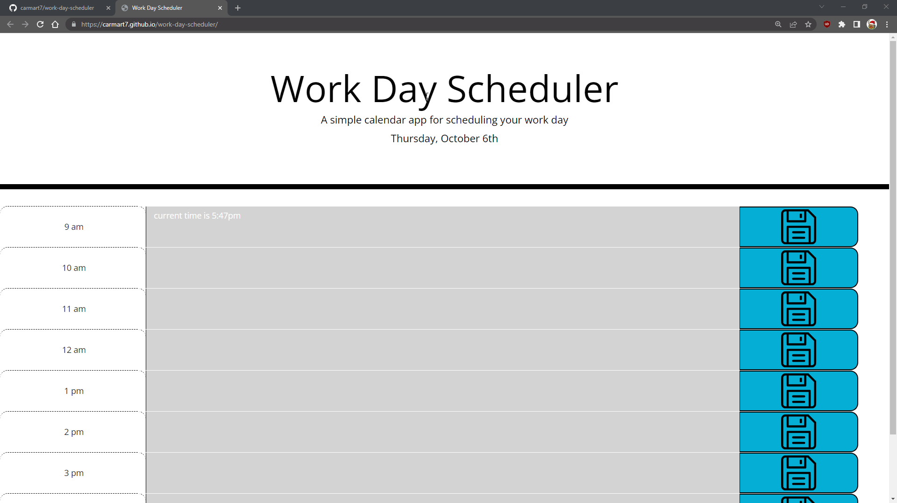

# Work Day Scheduler Starter Code

## Description

This site hosts a work day scheduler for the user to save tasks for each hour of the most common business day hours. It's built with html, css, and jss with a focus on displaying the ability to use multiple third party API's to design the page, modify the page, and get information such as current day to be placed on the page.

## Technologies Used

- [jQuery](https://jquery.com/)
- [Bootstrap](https://getbootstrap.com/)
- [Moment JS](https://momentjs.com/)
- [Visual Studio Code](https://code.visualstudio.com/)
- [Github](https://github.com/)

## Deployed Site

- [Work Day Scheduler](https://carmart7.github.io/project-portfolio/)